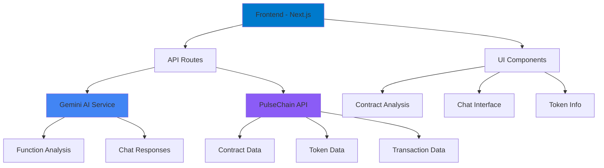

# 🤖 PulseChain AI Dashboard

> **Next-Generation Smart Contract Analysis & AI Learning Platform**  
> *Powered by Gemini AI & PulseChain Integration*

[](https://nextjs.org/)
[](https://www.typescriptlang.org/)
[](https://tailwindcss.com/)
[](https://ai.google.dev/)

<div align="center">


*A comprehensive AI-powered smart contract analysis tool with real-time chat capabilities, AI teachers, and interactive learning experiences*

[🚀 **Live Demo**](#live-demo) • [📖 **Documentation**](#documentation) • [🛠 **Installation**](#installation) • [🔧 **Configuration**](#configuration)

</div>

---

## 📋 Table of Contents

<details>
<summary>Click to expand</summary>

- [🎯 Overview](#-overview)
- [✨ Features](#-features)
- [🏗 Architecture](#-architecture)
- [🚀 Live Demo](#live-demo)
- [🛠 Installation](#-installation)
- [🔧 Configuration](#-configuration)
- [📖 Usage](#-usage)
- [🔌 API Reference](#-api-reference)
- [🏛 Project Structure](#-project-structure)
- [🎨 UI Components](#-ui-components)
- [👨‍🏫 AI Teachers](#-ai-teachers)
- [🤖 AI Integration](#-ai-integration)
- [🤖 AI-Agent (Code Reader)](#-ai-agent-code-reader)
- [🔒 Security](#-security)
- [🧪 Testing](#-testing)
- [📦 Deployment](#-deployment)
- [🤝 Contributing](#-contributing)
- [📄 License](#-license)
- [🙏 Acknowledgments](#-acknowledgments)

</details>

---

## 🎯 Overview

The **PulseChain AI Dashboard** is a cutting-edge smart contract analysis and AI learning platform that combines the power of Google's Gemini AI with blockchain technology to provide intelligent contract insights, real-time analysis, interactive chat capabilities, and personalized learning experiences with AI teachers.

### 🎪 Key Highlights

- **🤖 AI-Powered Analysis**: Leverages Gemini 2.5 Flash for intelligent contract interpretation
- **💬 Real-Time Chat**: Interactive conversation with AI about contract functionality
- **🔍 Function Analysis**: Detailed explanations of smart contract functions
- **📊 Token Information**: Comprehensive token data and market insights
- **👤 Creator Tracking**: Analyze contract creators and their activities
- **⚡ Streaming Responses**: Live AI responses with real-time text streaming
- **🎨 Modern UI**: Beautiful, responsive interface with dark theme
- **🔒 Type Safety**: Full TypeScript implementation with strict typing
- **👨‍🏫 AI Teachers**: Interactive learning with specialized AI experts
- **🎭 Multiple Personalities**: Different AI personas for various learning styles

---

## ✨ Features

### 🧠 **AI-Powered Intelligence**
- **Function Explanation**: AI-generated explanations for each contract function
- **Security Analysis**: Intelligent security insights and vulnerability detection
- **Code Interpretation**: Natural language explanations of complex Solidity code
- **Context-Aware Chat**: AI remembers contract context for meaningful conversations

### 📊 **Comprehensive Analysis**
- **Contract Overview**: Verification status, compiler info, and metadata
- **Token Information**: Market cap, supply, holders, and exchange rates
- **Function Categorization**: Read vs. write function classification
- **API Response Inspection**: Raw API data with collapsible JSON viewer

### 🎨 **User Experience**
- **Responsive Design**: Mobile-first approach with adaptive layouts
- **Dark Theme**: Eye-friendly dark interface with purple accents
- **Smooth Animations**: Fluid transitions and loading states
- **Accessibility**: ARIA labels, keyboard navigation, and screen reader support
- **Interactive Elements**: Hover effects, glowing animations, and visual feedback

### 🔧 **Developer Experience**
- **TypeScript**: Strict typing throughout the application
- **Modular Architecture**: Reusable components and clean separation of concerns
- **API Integration**: Ready for real PulseChain API integration
- **Error Handling**: Comprehensive error management and user feedback
- **Biome Integration**: Advanced code formatting and linting
- **Component Library**: Extensive UI component library with animations

---

## 🤖 AI-Agent (Code Reader)

The **AI-Agent (Code Reader)** is the flagship feature of the PulseChain AI Dashboard, providing intelligent smart contract analysis and interactive AI-powered conversations about blockchain code.

### 🎯 **Core Capabilities**

- **📝 Smart Contract Analysis**: Load and analyze any PulseChain contract by address
- **🤖 AI-Powered Function Explanation**: Get detailed explanations of each contract function
- **💬 Interactive AI Chat**: Ask questions about contract functionality and get real-time responses
- **📊 Comprehensive Data Display**: View contract metadata, token information, and creator details
- **🔍 Function Categorization**: Automatic classification of read vs. write functions
- **📈 Real-time Charts**: Live DEXScreener integration for market data visualization

### 🚀 **Key Features**

#### **Contract Loading & Analysis**
- **Address Input**: Enter any PulseChain contract address for instant analysis
- **Quick Search**: Pre-loaded popular contracts (WPLS, HEX, PLSX, INC) for quick access
- **Search Suggestions**: Intelligent search with contract name/ticker support
- **Loading States**: Beautiful loading animations with progress indicators

#### **AI-Powered Insights**
- **Function Explanations**: AI-generated explanations for each contract function
- **Security Analysis**: Intelligent security insights and vulnerability detection
- **Context-Aware Responses**: AI maintains conversation context for meaningful discussions
- **Structured Output**: Markdown-formatted responses with tabs and hashtags

#### **Interactive Interface**
- **Tabbed Navigation**: Organized sections for Creator, Source Code, API Response, Charts, and Chat
- **Responsive Design**: Mobile-optimized interface with adaptive layouts
- **Real-time Streaming**: Live AI responses with streaming text updates
- **Question Templates**: Pre-written questions for quick insights

#### **Data Visualization**
- **Token Information**: Market cap, supply, holders, and exchange rates
- **Creator Analysis**: Contract creator details and transaction history
- **DEXScreener Charts**: Live trading pair charts with market data
- **Source Code Display**: Syntax-highlighted contract source code

### 🎨 **User Interface**

#### **Dark Theme Design**
- **Consistent Dark Background**: Black backgrounds throughout the application
- **Purple Accents**: PulseChain-themed purple color scheme
- **Glowing Effects**: Dynamic animations and visual feedback
- **Aurora Background**: Animated gradient background effects

#### **Loading Experience**
- **Optimized Loader**: Reduced hook loader size for better performance
- **Smooth Transitions**: Fluid animations between states
- **Progress Indicators**: Clear feedback during data loading

#### **Footer Design**
- **Bottom Positioning**: Footer positioned at the bottom of pages, not constantly visible
- **Minimal Footprint**: Thin, unobtrusive footer design
- **Essential Links**: GitHub repository and disclaimer information

### 🔧 **Technical Implementation**

#### **AI Integration**
- **Gemini 2.5 Flash**: Advanced AI model for contract analysis
- **Streaming Responses**: Real-time text streaming for better UX
- **Context Management**: Maintains conversation history and contract context
- **Error Handling**: Graceful error handling with user-friendly messages

#### **API Architecture**
- **RESTful Endpoints**: Clean API design for contract analysis and chat
- **Rate Limiting**: Built-in rate limiting to prevent abuse
- **Caching**: Intelligent caching for improved performance
- **Error Recovery**: Automatic retry mechanisms for failed requests

#### **Performance Optimization**
- **Lazy Loading**: Components load only when needed
- **Code Splitting**: Efficient bundle splitting for faster loading
- **Image Optimization**: Optimized images and icons
- **Memory Management**: Efficient state management and cleanup

### 📱 **Mobile Experience**

- **Touch-Optimized**: Large touch targets and swipe gestures
- **Responsive Layout**: Adaptive design for all screen sizes
- **Mobile Navigation**: Bottom navigation for easy access
- **Performance**: Optimized for mobile network conditions

### 🔒 **Security & Privacy**

- **Client-Side API Keys**: User API keys stored in session storage
- **No Server Storage**: API keys never stored on server
- **Input Validation**: All inputs validated and sanitized
- **Secure Communication**: HTTPS-only communication

---

## 📁 **AI-Agent File Structure & Components**

### **Core Files**

```
app/ai-agent/
├── page.tsx                    # Main AI-Agent page component
└── loading.tsx                 # Loading state component

app/api/
├── analyze/route.ts            # Contract analysis API endpoint
├── chat/route.ts               # AI chat API endpoint
├── gemini/route.ts             # Gemini AI integration
└── test-api-key/route.ts       # API key validation endpoint

components/
├── AbiFunctionsList.tsx        # Contract functions display
├── ApiResponseTab.tsx          # Raw API data viewer
├── CreatorTab.tsx              # Contract creator information
├── SourceCodeTab.tsx           # Source code display
├── TokenInfoCard.tsx           # Token information card
├── UnverifiedContractRisksModal.tsx # Risk warning modal
├── ApiKeyModal.tsx             # API key input modal
├── GlobalHeader.tsx            # Global navigation header
├── GlobalFooter.tsx            # Global footer component
└── JsonViewer.tsx              # JSON data visualization

lib/
├── gemini.ts                   # Gemini AI client configuration
├── hooks/
│   ├── useApiKey.ts            # API key management hook
│   ├── useGemini.ts            # Gemini AI integration hook
│   └── usePageLoading.ts       # Page loading state hook
└── utils.ts                    # Utility functions

services/
└── pulsechainService.ts        # PulseChain API integration
```

### **Key Components Breakdown**

#### **Main Page (`app/ai-agent/page.tsx`)**
- **Contract Address Input**: Search and validation
- **Loading States**: Multiple loading animations
- **Tab Navigation**: Creator, Code, API, Charts, Chat
- **Real-time Chat**: Interactive AI conversations
- **Responsive Design**: Mobile-optimized layout

#### **API Endpoints**
- **`/api/analyze`**: Contract analysis and function explanation
- **`/api/chat`**: AI chat with context preservation
- **`/api/gemini`**: Direct Gemini AI integration
- **`/api/test-api-key`**: API key validation

#### **UI Components**
- **`AbiFunctionsList`**: Displays and explains contract functions
- **`TokenInfoCard`**: Shows token metadata and market data
- **`ApiResponseTab`**: Raw API data with collapsible JSON
- **`CreatorTab`**: Contract creator analysis
- **`SourceCodeTab`**: Syntax-highlighted source code
- **`ApiKeyModal`**: Secure API key input with validation

### 🔧 **How It Works**

#### **1. Contract Loading Process**
```typescript
// User enters contract address
const contractAddress = "0x...";

// System validates address format
if (!isValidAddress(contractAddress)) {
  throw new Error("Invalid contract address");
}

// Fetches contract data from PulseChain API
const contractData = await fetchContractData(contractAddress);

// Analyzes contract ABI and functions
const analyzedFunctions = await analyzeContractFunctions(contractData);
```

#### **2. AI Analysis Pipeline**
```typescript
// Sends contract data to Gemini AI
const aiResponse = await gemini.analyze({
  contractAddress,
  abi: contractData.abi,
  sourceCode: contractData.sourceCode,
  functions: contractData.functions
});

// Processes and formats AI response
const explainedFunctions = formatAIResponse(aiResponse);
```

#### **3. Chat Integration**
```typescript
// Maintains conversation context
const chatHistory = [
  { role: "user", content: "What does this function do?" },
  { role: "assistant", content: "This function..." }
];

// Sends context-aware request
const response = await gemini.chat({
  message: userMessage,
  history: chatHistory,
  contractContext: contractData
});
```

#### **4. Real-time Streaming**
```typescript
// Creates streaming response
const stream = await gemini.streamResponse(prompt);

// Processes chunks in real-time
for await (const chunk of stream) {
  setResponseText(prev => prev + chunk.text);
}
```

### 🚀 **Features Deep Dive**

#### **Smart Contract Analysis**
- **ABI Parsing**: Automatic parsing of contract Application Binary Interface
- **Function Categorization**: Separates read vs. write functions
- **Security Scanning**: Identifies potential vulnerabilities
- **Gas Estimation**: Provides gas cost estimates for functions

#### **AI-Powered Explanations**
- **Natural Language**: Converts complex code to plain English
- **Context Awareness**: Understands contract purpose and relationships
- **Security Insights**: Highlights potential risks and best practices
- **Code Examples**: Provides usage examples for functions

#### **Interactive Chat System**
- **Context Preservation**: Remembers conversation history
- **Contract Awareness**: AI understands the specific contract being analyzed
- **Question Templates**: Pre-written questions for common scenarios
- **Real-time Responses**: Streaming text for immediate feedback

#### **Data Visualization**
- **Token Metrics**: Market cap, supply, price, volume
- **Creator Analysis**: Transaction history and patterns
- **DEXScreener Integration**: Live trading data and charts
- **Source Code Highlighting**: Syntax-colored code display

### 🔒 **Security Features**

#### **API Key Management**
- **Session Storage**: Keys stored only in browser session
- **No Server Storage**: Keys never saved on server
- **Automatic Cleanup**: Keys cleared on browser close
- **Validation**: Real-time API key testing

#### **Input Validation**
- **Address Format**: Validates Ethereum/PulseChain addresses
- **Content Sanitization**: Prevents XSS and injection attacks
- **Rate Limiting**: Prevents API abuse
- **Error Handling**: Graceful error recovery

### 📱 **Mobile Optimization**

#### **Responsive Design**
- **Adaptive Layout**: Adjusts to screen size
- **Touch Targets**: Large, accessible buttons
- **Mobile Navigation**: Bottom navigation bar
- **Optimized Loading**: Reduced bundle sizes

#### **Performance**
- **Lazy Loading**: Components load on demand
- **Code Splitting**: Efficient bundle distribution
- **Caching**: Intelligent data caching
- **Memory Management**: Efficient state handling

### 🔧 **Forking & Customization**

#### **Prerequisites**
```bash
# Required dependencies
Node.js 18.17+
npm 9.0+ or yarn 1.22+
Git for version control
```

#### **Forking Steps**
```bash
# 1. Fork the repository
# Visit: https://github.com/InVisionCRM/PulseChainAI.com
# Click "Fork" button

# 2. Clone your fork
git clone https://github.com/YOUR_USERNAME/PulseChainAI.com.git
cd PulseChainAI.com

# 3. Install dependencies
npm install

# 4. Set up environment variables
cp .env.example .env.local
# Edit .env.local with your API keys

# 5. Start development server
npm run dev
```

#### **Environment Configuration**
```env
# Required: Gemini AI API Key
API_KEY=your_gemini_api_key_here

# Optional: PulseChain API Configuration
PULSECHAIN_API_URL=https://api.pulsechain.com
PULSECHAIN_API_KEY=your_pulsechain_api_key_here

# Optional: Analytics
NEXT_PUBLIC_GA_ID=your_google_analytics_id
```

#### **Customization Options**

##### **1. AI Model Configuration**
```typescript
// lib/gemini.ts
export const geminiConfig = {
  model: 'gemini-2.5-flash',  // Change AI model
  temperature: 0.7,           // Adjust creativity
  maxTokens: 2048,            // Set response length
  topP: 0.9                   // Control randomness
};
```

##### **2. UI Customization**
```typescript
// components/ui/aurora-background.tsx
const defaultColors = [
  '#EC13AC', '#364AFF', '#EF1091',  // Customize colors
  '#3F41FF', '#D917E9', '#215FFF'
];
```

##### **3. API Integration**
```typescript
// services/pulsechainService.ts
export const API_ENDPOINTS = {
  contract: 'https://your-api.com/contract',  // Custom API
  token: 'https://your-api.com/token',
  transaction: 'https://your-api.com/tx'
};
```

##### **4. Feature Toggles**
```typescript
// lib/config.ts
export const FEATURES = {
  enableChat: true,           // Enable/disable chat
  enableCharts: true,         // Enable/disable charts
  enableCreatorAnalysis: true, // Enable/disable creator tab
  enableSourceCode: true      // Enable/disable source code
};
```

#### **Deployment Options**

##### **Vercel Deployment**
```bash
# Install Vercel CLI
npm i -g vercel

# Deploy
vercel

# Set environment variables
vercel env add API_KEY
```

##### **Docker Deployment**
```dockerfile
# Dockerfile
FROM node:18-alpine
WORKDIR /app
COPY package*.json ./
RUN npm ci --only=production
COPY . .
RUN npm run build
EXPOSE 3000
CMD ["npm", "start"]
```

##### **Self-Hosted**
```bash
# Build for production
npm run build

# Start production server
npm start

# Or use PM2
pm2 start npm --name "pulsechain-ai" -- start
```

### 🧪 **Testing & Development**

#### **Running Tests**
```bash
# Unit tests
npm run test

# Integration tests
npm run test:integration

# E2E tests
npm run test:e2e

# Type checking
npm run type-check

# Linting
npm run lint
```

#### **Development Workflow**
```bash
# Start development server
npm run dev

# Build for production
npm run build

# Analyze bundle
npm run analyze

# Format code
npm run format
```

### 📊 **Performance Monitoring**

#### **Key Metrics**
- **First Contentful Paint**: < 1.5s
- **Largest Contentful Paint**: < 2.5s
- **Cumulative Layout Shift**: < 0.1
- **First Input Delay**: < 100ms

#### **Optimization Techniques**
- **Code Splitting**: Dynamic imports for components
- **Image Optimization**: Next.js Image component
- **Caching**: Strategic caching strategies
- **Bundle Analysis**: Regular bundle size monitoring

### 🔄 **Updates & Maintenance**

#### **Regular Updates**
```bash
# Update dependencies
npm update

# Check for security vulnerabilities
npm audit

# Update to latest Next.js
npm install next@latest
```

#### **Monitoring**
- **Error Tracking**: Implement error monitoring
- **Performance Monitoring**: Track Core Web Vitals
- **Usage Analytics**: Monitor feature usage
- **Security Audits**: Regular security reviews

This comprehensive AI-Agent system provides a complete solution for smart contract analysis with advanced AI capabilities, ensuring users can understand and interact with blockchain contracts effectively.

---

## 🏗 Architecture



### **Technology Stack**

| Layer | Technology | Purpose |
|-------|------------|---------|
| **Frontend** | Next.js 15 + React 19 | Modern web framework with App Router |
| **Styling** | Tailwind CSS 4.0 | Utility-first CSS framework |
| **Language** | TypeScript 5.0 | Type-safe JavaScript development |
| **AI Engine** | Gemini 2.5 Flash | Advanced AI analysis and chat |
| **State Management** | React Hooks | Modern state management |
| **API Integration** | Fetch API | RESTful API communication |
| **Build Tool** | Next.js Bundler | Optimized production builds |
| **Code Quality** | Biome | Advanced linting and formatting |
| **Animations** | Framer Motion | Smooth UI animations |

---

## 🚀 Live Demo

<div align="center">

**🔗 [Try the AI Code Reader Live](https://your-demo-url.com)**

*Experience the power of AI-driven contract analysis*

</div>

### 🎬 Demo Features

- **📝 Contract Loading**: Load any PulseChain contract by address
- **🤖 AI Analysis**: Watch AI explain contract functions in real-time
- **💬 Interactive Chat**: Ask questions about contract functionality
- **📊 Data Visualization**: Explore token information and creator data
- **👨‍🏫 AI Teachers**: Learn from specialized AI experts in various fields
- **🎭 Multiple AI Personalities**: Experience different teaching styles and approaches
- **📈 Real-time Charts**: Live DEXScreener integration for market data

---

## 🛠 Installation

### **Prerequisites**

- **Node.js** 18.17+ (LTS recommended)
- **npm** 9.0+ or **yarn** 1.22+
- **Git** for version control

### **Quick Start**

```bash
# 1. Clone the repository
git clone https://github.com/InVisionCRM/PulseChainAI.com.git
cd PulseChainAI.com

# 2. Install dependencies
npm install
# or
yarn install

# 3. Set up environment variables
cp .env.example .env.local
# Edit .env.local with your API keys

# 4. Start development server
npm run dev
# or
yarn dev

# 5. Open your browser
open http://localhost:3000
```

### **Environment Variables**

Create a `.env.local` file in the root directory:

```env
# Gemini AI Configuration
API_KEY=your_gemini_api_key_here

# Optional: PulseChain API Configuration
PULSECHAIN_API_URL=https://api.pulsechain.com
PULSECHAIN_API_KEY=your_pulsechain_api_key_here

# Optional: Analytics
NEXT_PUBLIC_GA_ID=your_google_analytics_id
```

### **Getting API Keys**

#### **Gemini AI API Key**
1. Visit [Google AI Studio](https://makersuite.google.com/app/apikey)
2. Sign in with your Google account
3. Create a new API key
4. Copy the key to your `.env.local` file

#### **PulseChain API Key** (Optional)
1. Visit [PulseChain API Documentation](https://docs.pulsechain.com)
2. Register for API access
3. Generate your API key
4. Add to your `.env.local` file

---

## 🔧 Configuration

### **Next.js Configuration**

```typescript
// next.config.ts
import type { NextConfig } from "next";

const nextConfig: NextConfig = {
  images: {
    remotePatterns: [
      {
        protocol: 'https',
        hostname: 'via.placeholder.com',
        port: '',
        pathname: '/**',
      },
    ],
  },
  // Additional configuration options
  experimental: {
    // Enable experimental features
  },
};

export default nextConfig;
```

### **TypeScript Configuration**

```json
// tsconfig.json
{
  "compilerOptions": {
    "target": "ES2020",
    "lib": ["dom", "dom.iterable", "es6"],
    "allowJs": true,
    "skipLibCheck": true,
    "strict": true,
    "forceConsistentCasingInFileNames": true,
    "noEmit": true,
    "esModuleInterop": true,
    "module": "esnext",
    "moduleResolution": "bundler",
    "resolveJsonModule": true,
    "isolatedModules": true,
    "jsx": "preserve",
    "incremental": true,
    "plugins": [
      {
        "name": "next"
      }
    ],
    "paths": {
      "@/*": ["./*"]
    }
  },
  "include": ["next-env.d.ts", "**/*.ts", "**/*.tsx", ".next/types/**/*.ts"],
  "exclude": ["node_modules"]
}
```

---

## 📖 Usage

### **Basic Usage**

1. **Load a Contract**: Enter a PulseChain contract address in the search field
2. **View Analysis**: Explore the AI-generated function explanations
3. **Chat with AI**: Ask questions about the contract functionality
4. **Explore Data**: Check token information, creator details, and market data

### **Advanced Features**

- **Quick Search**: Use predefined contract addresses for instant analysis
- **Template Questions**: Click on suggested questions for quick insights
- **Chart Integration**: View live DEXScreener charts for token pairs
- **Source Code Analysis**: Explore contract source code with syntax highlighting
- **AI Teacher Sessions**: Interactive learning with specialized AI experts
- **Multiple AI Personalities**: Different teaching styles for various learning preferences
- **Real-time Streaming**: Live AI responses with streaming text updates
- **Mobile Optimization**: Fully responsive design for all devices

---

## 🔌 API Reference

### **Contract Analysis API**

```typescript
POST /api/analyze
{
  "address": "0x...",
  "includeFunctions": true,
  "includeTokenInfo": true
}
```

### **Chat API**

```typescript
POST /api/chat
{
  "message": "What does this function do?",
  "contractAddress": "0x...",
  "context": "previous conversation context"
}
```

### **Gemini Integration**

```typescript
POST /api/gemini
{
  "prompt": "Analyze this smart contract function",
  "context": "contract ABI and source code"
}
```

### **AI Teacher APIs**

```typescript
POST /api/marcus-johnson
POST /api/alex-rivera
POST /api/maya-patel
POST /api/james-wilson
POST /api/elena-rodriguez
POST /api/therapist
{
  "message": "Your question here",
  "history": "conversation context"
}
```

---

## 🏛 Project Structure

```
pulse-chain-ai-dash/
├── app/                    # Next.js App Router
│   ├── ai-agent/          # AI Agent page
│   ├── api/               # API routes
│   │   ├── analyze/       # Contract analysis
│   │   ├── chat/          # AI chat
│   │   ├── gemini/        # Gemini AI integration
│   │   ├── therapist/     # AI therapist
│   │   ├── marcus-johnson/ # Blockchain philosophy expert
│   │   ├── alex-rivera/   # Smart contract developer
│   │   ├── maya-patel/    # Technical analysis specialist
│   │   ├── james-wilson/  # Community building expert
│   │   └── elena-rodriguez/ # DeFi strategy advisor
│   ├── therapist/         # AI therapist page
│   ├── marcus-johnson/    # Blockchain philosophy page
│   ├── alex-rivera/       # Smart contract development page
│   ├── maya-patel/        # Technical analysis page
│   ├── james-wilson/      # Community building page
│   ├── elena-rodriguez/   # DeFi strategy page
│   ├── globals.css        # Global styles
│   └── layout.tsx         # Root layout
├── components/            # React components
│   ├── ui/               # UI components
│   ├── icons/            # Icon components
│   ├── AIAgentsSection.tsx # AI agents showcase
│   ├── TeachersSection.tsx # AI teachers showcase
│   └── ...               # Feature components
├── lib/                  # Utility libraries
│   ├── gemini.ts         # Gemini AI client
│   ├── hooks/            # Custom React hooks
│   └── utils.ts          # Utility functions
├── services/             # External service integrations
│   └── pulsechainService.ts
├── types.ts              # TypeScript type definitions
└── ...                   # Configuration files
```

---

## 🎨 UI Components

### **Core Components**

- **TokenInfoCard**: Displays contract and token information
- **AIAgentsSection**: AI chat interface with streaming responses
- **TeachersSection**: AI teachers showcase with interactive cards
- **AbiFunctionsList**: Lists and explains contract functions
- **CreatorTab**: Shows contract creator information
- **ChartTab**: Displays DEXScreener charts
- **SourceCodeTab**: Shows contract source code with syntax highlighting

### **UI Utilities**

- **AuroraBackground**: Animated background with gradient effects
- **HoverBorderGradient**: Interactive border animations
- **LoaderThree**: Custom loading animation with PulseChain logo
- **CopyButton**: Copy-to-clipboard functionality
- **GlowingEffect**: Dynamic glowing animations
- **ColourfulText**: Animated text effects

---

## 👨‍🏫 AI Teachers

The platform features a comprehensive AI teacher system with specialized experts in various blockchain and cryptocurrency domains.

### **Available AI Teachers**

| Teacher | Specialty | Expertise Areas |
|---------|-----------|-----------------|
| **Dr. Marcus Johnson** | Blockchain Philosophy | Digital ethics, decentralization, economic theory |
| **Dr. Sarah Chen** | Crypto Psychology | Trading psychology, emotional management, mental wellness |
| **Alex Rivera** | Smart Contract Development | Solidity, DeFi protocols, security, gas optimization |
| **Maya Patel** | Technical Analysis | Chart patterns, indicators, risk management, market analysis |
| **James Wilson** | Community Building | DAO governance, engagement strategies, crisis management |
| **Elena Rodriguez** | DeFi Strategy | Yield farming, protocol analysis, risk assessment |

### **Teacher Features**

- **🎭 Unique Personalities**: Each teacher has distinct communication styles and expertise
- **💬 Interactive Chat**: Real-time conversations with specialized knowledge
- **📚 Question Templates**: Pre-written questions to get started quickly
- **🎨 Themed Interfaces**: Unique color schemes and styling for each teacher
- **📱 Mobile Optimized**: Fully responsive design for all devices

### **Learning Experience**

- **Personalized Guidance**: Tailored responses based on teacher expertise
- **Practical Examples**: Real-world applications and case studies
- **Progressive Learning**: Structured approach to complex topics
- **Continuous Support**: Ongoing assistance and clarification

---

## 🤖 AI Integration

### **Gemini AI Features**

- **Function Analysis**: AI explains each contract function
- **Security Insights**: Identifies potential vulnerabilities
- **Context-Aware Chat**: Maintains conversation context
- **Structured Responses**: Markdown-formatted output with tabs and hashtags

### **AI Prompt Engineering**

The system uses carefully crafted prompts to ensure:
- **Consistent Formatting**: Structured markdown responses
- **Technical Accuracy**: Precise function explanations
- **User-Friendly Language**: Clear, accessible explanations
- **Context Preservation**: Maintains conversation flow
- **Personality Consistency**: Each AI teacher maintains their unique character
- **Expertise Focus**: Responses tailored to specific domains and specialties

---

## 🔒 Security

### **Security Features**

- **Input Validation**: All user inputs are validated and sanitized
- **API Key Protection**: Server-side API key handling
- **Error Handling**: Comprehensive error management
- **Rate Limiting**: API rate limiting to prevent abuse

### **Best Practices**

- **Environment Variables**: Sensitive data stored in environment variables
- **Type Safety**: Full TypeScript implementation prevents runtime errors
- **Input Sanitization**: All user inputs are properly sanitized
- **Secure Headers**: Proper security headers configuration

---

## 🧪 Testing

### **Testing Strategy**

```bash
# Run unit tests
npm run test

# Run integration tests
npm run test:integration

# Run end-to-end tests
npm run test:e2e

# Run type checking
npm run type-check

# Run linting
npm run lint
```

### **Test Coverage**

- **Unit Tests**: Component and utility function testing
- **Integration Tests**: API route and service testing
- **E2E Tests**: Full user workflow testing
- **Type Checking**: TypeScript compilation verification

---

## 📦 Deployment

### **Vercel Deployment**

```bash
# Install Vercel CLI
npm i -g vercel

# Deploy to Vercel
vercel

# Set environment variables
vercel env add API_KEY
```

### **Environment Setup**

1. **Production Environment**: Set up production environment variables
2. **Domain Configuration**: Configure custom domain if needed
3. **SSL Certificate**: Automatic SSL certificate provisioning
4. **CDN**: Global content delivery network

---

## 🤝 Contributing

### **Development Workflow**

1. **Fork the Repository**: Create your own fork
2. **Create Feature Branch**: `git checkout -b feature/amazing-feature`
3. **Make Changes**: Implement your feature or fix
4. **Run Tests**: Ensure all tests pass
5. **Submit Pull Request**: Create a detailed PR description

### **Code Standards**

- **TypeScript**: Strict typing throughout
- **Biome**: Advanced linting and formatting with Biome
- **Conventional Commits**: Follow commit message conventions
- **Component Architecture**: Modular, reusable component design
- **Performance Optimization**: Efficient rendering and state management

---

## 📄 License

This project is licensed under the MIT License - see the [LICENSE](LICENSE) file for details.

---

## 🙏 Acknowledgments

- **Google Gemini AI**: For providing the AI capabilities
- **PulseChain**: For the blockchain infrastructure
- **Next.js Team**: For the amazing framework
- **Tailwind CSS**: For the utility-first CSS framework
- **Framer Motion**: For smooth animations and interactions
- **Biome**: For advanced code quality and formatting
- **Open Source Community**: For all the amazing tools and libraries

---

<div align="center">

**Made with ❤️ for the PulseChain community**

[](https://github.com/InVisionCRM/PulseChainAI.com)
[](https://github.com/InVisionCRM/PulseChainAI.com)
[](https://github.com/InVisionCRM/PulseChainAI.com/issues)

</div> 