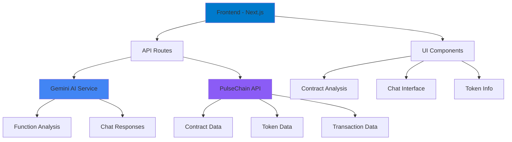

# 🤖 AI Code Reader/Chat Bot

> **Next-Generation Smart Contract Analysis Platform**  
> *Powered by Gemini AI & PulseChain Integration*

[](https://nextjs.org/)
[](https://www.typescriptlang.org/)
[](https://tailwindcss.com/)
[](https://ai.google.dev/)

<div align="center">


*A comprehensive AI-powered smart contract analysis tool with real-time chat capabilities*

[🚀 **Live Demo**](#live-demo) • [📖 **Documentation**](#documentation) • [🛠 **Installation**](#installation) • [🔧 **Configuration**](#configuration)

</div>

---

## 📋 Table of Contents

<details>
<summary>Click to expand</summary>

- [🎯 Overview](#-overview)
- [✨ Features](#-features)
- [🏗 Architecture](#-architecture)
- [🚀 Live Demo](#live-demo)
- [🛠 Installation](#-installation)
- [🔧 Configuration](#-configuration)
- [📖 Usage](#-usage)
- [🔌 API Reference](#-api-reference)
- [🏛 Project Structure](#-project-structure)
- [🎨 UI Components](#-ui-components)
- [🤖 AI Integration](#-ai-integration)
- [🔒 Security](#-security)
- [🧪 Testing](#-testing)
- [📦 Deployment](#-deployment)
- [🤝 Contributing](#-contributing)
- [📄 License](#-license)
- [🙏 Acknowledgments](#-acknowledgments)

</details>

---

## 🎯 Overview

The **AI Code Reader/Chat Bot** is a cutting-edge smart contract analysis platform that combines the power of Google's Gemini AI with blockchain technology to provide intelligent contract insights, real-time analysis, and interactive chat capabilities.

### 🎪 Key Highlights

- **🤖 AI-Powered Analysis**: Leverages Gemini 2.5 Flash for intelligent contract interpretation
- **💬 Real-Time Chat**: Interactive conversation with AI about contract functionality
- **🔍 Function Analysis**: Detailed explanations of smart contract functions
- **📊 Token Information**: Comprehensive token data and market insights
- **👤 Creator Tracking**: Analyze contract creators and their activities
- **⚡ Streaming Responses**: Live AI responses with real-time text streaming
- **🎨 Modern UI**: Beautiful, responsive interface with dark theme
- **🔒 Type Safety**: Full TypeScript implementation with strict typing

---

## ✨ Features

### 🧠 **AI-Powered Intelligence**
- **Function Explanation**: AI-generated explanations for each contract function
- **Security Analysis**: Intelligent security insights and vulnerability detection
- **Code Interpretation**: Natural language explanations of complex Solidity code
- **Context-Aware Chat**: AI remembers contract context for meaningful conversations

### 📊 **Comprehensive Analysis**
- **Contract Overview**: Verification status, compiler info, and metadata
- **Token Information**: Market cap, supply, holders, and exchange rates
- **Function Categorization**: Read vs. write function classification
- **API Response Inspection**: Raw API data with collapsible JSON viewer

### 🎨 **User Experience**
- **Responsive Design**: Mobile-first approach with adaptive layouts
- **Dark Theme**: Eye-friendly dark interface with purple accents
- **Smooth Animations**: Fluid transitions and loading states
- **Accessibility**: ARIA labels, keyboard navigation, and screen reader support

### 🔧 **Developer Experience**
- **TypeScript**: Strict typing throughout the application
- **Modular Architecture**: Reusable components and clean separation of concerns
- **API Integration**: Ready for real PulseChain API integration
- **Error Handling**: Comprehensive error management and user feedback

---

## 🏗 Architecture



### **Technology Stack**

| Layer | Technology | Purpose |
|-------|------------|---------|
| **Frontend** | Next.js 15 + React 19 | Modern web framework with App Router |
| **Styling** | Tailwind CSS 4.0 | Utility-first CSS framework |
| **Language** | TypeScript 5.0 | Type-safe JavaScript development |
| **AI Engine** | Gemini 2.5 Flash | Advanced AI analysis and chat |
| **State Management** | React Hooks | Modern state management |
| **API Integration** | Fetch API | RESTful API communication |
| **Build Tool** | Next.js Bundler | Optimized production builds |

---

## 🚀 Live Demo

<div align="center">

**🔗 [Try the AI Code Reader Live](https://your-demo-url.com)**

*Experience the power of AI-driven contract analysis*

</div>

### 🎬 Demo Features

- **📝 Contract Loading**: Load any PulseChain contract by address
- **🤖 AI Analysis**: Watch AI explain contract functions in real-time
- **💬 Interactive Chat**: Ask questions about contract functionality
- **📊 Data Visualization**: Explore token information and creator data

---

## 🛠 Installation

### **Prerequisites**

- **Node.js** 18.17+ (LTS recommended)
- **npm** 9.0+ or **yarn** 1.22+
- **Git** for version control

### **Quick Start**

```bash
# 1. Clone the repository
git clone https://github.com/InVisionCRM/PulseChainAI.com.git
cd PulseChainAI.com

# 2. Install dependencies
npm install
# or
yarn install

# 3. Set up environment variables
cp .env.example .env.local
# Edit .env.local with your API keys

# 4. Start development server
npm run dev
# or
yarn dev

# 5. Open your browser
open http://localhost:3000
```

### **Environment Variables**

Create a `.env.local` file in the root directory:

```env
# Gemini AI Configuration
API_KEY=your_gemini_api_key_here

# Optional: PulseChain API Configuration
PULSECHAIN_API_URL=https://api.pulsechain.com
PULSECHAIN_API_KEY=your_pulsechain_api_key_here

# Optional: Analytics
NEXT_PUBLIC_GA_ID=your_google_analytics_id
```

### **Getting API Keys**

#### **Gemini AI API Key**
1. Visit [Google AI Studio](https://makersuite.google.com/app/apikey)
2. Sign in with your Google account
3. Create a new API key
4. Copy the key to your `.env.local` file

#### **PulseChain API Key** (Optional)
1. Visit [PulseChain API Documentation](https://docs.pulsechain.com)
2. Register for API access
3. Generate your API key
4. Add to your `.env.local` file

---

## 🔧 Configuration

### **Next.js Configuration**

```typescript
// next.config.ts
import type { NextConfig } from "next";

const nextConfig: NextConfig = {
  images: {
    remotePatterns: [
      {
        protocol: 'https',
        hostname: 'via.placeholder.com',
        port: '',
        pathname: '/**',
      },
    ],
  },
  // Additional configuration options
  experimental: {
    // Enable experimental features
  },
};

export default nextConfig;
```

### **TypeScript Configuration**

```json
// tsconfig.json
{
  "compilerOptions": {
    "target": "ES2020",
    "lib": ["dom", "dom.iterable", "es6"],
    "allowJs": true,
    "skipLibCheck": true,
    "strict": true,
    "forceConsistentCasingInFileNames": true,
    "noEmit": true,
    "esModuleInterop": true,
    "module": "esnext",
    "moduleResolution": "bundler",
    "resolveJsonModule": true,
    "isolatedModules": true,
    "jsx": "preserve",
    "incremental": true,
    "plugins": [
      {
        "name": "next"
      }
    ],
    "paths": {
      "@/*": ["./*"]
    }
  },
  "include": ["next-env.d.ts", "**/*.ts", "**/*.tsx", ".next/types/**/*.ts"],
  "exclude": ["node_modules"]
}
```

---

## 📖 Usage

### **Basic Usage**

1. **Load a Contract**: Enter a PulseChain contract address in the search field
2. **View Analysis**: Explore the AI-generated function explanations
3. **Chat with AI**: Ask questions about the contract functionality
4. **Explore Data**: Check token information, creator details, and market data

### **Advanced Features**

- **Quick Search**: Use predefined contract addresses for instant analysis
- **Template Questions**: Click on suggested questions for quick insights
- **Chart Integration**: View live DEXScreener charts for token pairs
- **Source Code Analysis**: Explore contract source code with syntax highlighting

---

## 🔌 API Reference

### **Contract Analysis API**

```typescript
POST /api/analyze
{
  "address": "0x...",
  "includeFunctions": true,
  "includeTokenInfo": true
}
```

### **Chat API**

```typescript
POST /api/chat
{
  "message": "What does this function do?",
  "contractAddress": "0x...",
  "context": "previous conversation context"
}
```

### **Gemini Integration**

```typescript
POST /api/gemini
{
  "prompt": "Analyze this smart contract function",
  "context": "contract ABI and source code"
}
```

---

## 🏛 Project Structure

```
pulse-chain-ai-dash/
├── app/                    # Next.js App Router
│   ├── ai-agent/          # AI Agent page
│   ├── api/               # API routes
│   │   ├── analyze/       # Contract analysis
│   │   ├── chat/          # AI chat
│   │   └── gemini/        # Gemini AI integration
│   ├── globals.css        # Global styles
│   └── layout.tsx         # Root layout
├── components/            # React components
│   ├── ui/               # UI components
│   ├── icons/            # Icon components
│   └── ...               # Feature components
├── lib/                  # Utility libraries
│   ├── gemini.ts         # Gemini AI client
│   ├── hooks/            # Custom React hooks
│   └── utils.ts          # Utility functions
├── services/             # External service integrations
│   └── pulsechainService.ts
├── types.ts              # TypeScript type definitions
└── ...                   # Configuration files
```

---

## 🎨 UI Components

### **Core Components**

- **TokenInfoCard**: Displays contract and token information
- **AIAgentsSection**: AI chat interface with streaming responses
- **AbiFunctionsList**: Lists and explains contract functions
- **CreatorTab**: Shows contract creator information
- **ChartTab**: Displays DEXScreener charts
- **SourceCodeTab**: Shows contract source code with syntax highlighting

### **UI Utilities**

- **AuroraBackground**: Animated background with gradient effects
- **HoverBorderGradient**: Interactive border animations
- **LoaderThree**: Custom loading animation with PulseChain logo
- **CopyButton**: Copy-to-clipboard functionality

---

## 🤖 AI Integration

### **Gemini AI Features**

- **Function Analysis**: AI explains each contract function
- **Security Insights**: Identifies potential vulnerabilities
- **Context-Aware Chat**: Maintains conversation context
- **Structured Responses**: Markdown-formatted output with tabs and hashtags

### **AI Prompt Engineering**

The system uses carefully crafted prompts to ensure:
- **Consistent Formatting**: Structured markdown responses
- **Technical Accuracy**: Precise function explanations
- **User-Friendly Language**: Clear, accessible explanations
- **Context Preservation**: Maintains conversation flow

---

## 🔒 Security

### **Security Features**

- **Input Validation**: All user inputs are validated and sanitized
- **API Key Protection**: Server-side API key handling
- **Error Handling**: Comprehensive error management
- **Rate Limiting**: API rate limiting to prevent abuse

### **Best Practices**

- **Environment Variables**: Sensitive data stored in environment variables
- **Type Safety**: Full TypeScript implementation prevents runtime errors
- **Input Sanitization**: All user inputs are properly sanitized
- **Secure Headers**: Proper security headers configuration

---

## 🧪 Testing

### **Testing Strategy**

```bash
# Run unit tests
npm run test

# Run integration tests
npm run test:integration

# Run end-to-end tests
npm run test:e2e

# Run type checking
npm run type-check

# Run linting
npm run lint
```

### **Test Coverage**

- **Unit Tests**: Component and utility function testing
- **Integration Tests**: API route and service testing
- **E2E Tests**: Full user workflow testing
- **Type Checking**: TypeScript compilation verification

---

## 📦 Deployment

### **Vercel Deployment**

```bash
# Install Vercel CLI
npm i -g vercel

# Deploy to Vercel
vercel

# Set environment variables
vercel env add API_KEY
```

### **Environment Setup**

1. **Production Environment**: Set up production environment variables
2. **Domain Configuration**: Configure custom domain if needed
3. **SSL Certificate**: Automatic SSL certificate provisioning
4. **CDN**: Global content delivery network

---

## 🤝 Contributing

### **Development Workflow**

1. **Fork the Repository**: Create your own fork
2. **Create Feature Branch**: `git checkout -b feature/amazing-feature`
3. **Make Changes**: Implement your feature or fix
4. **Run Tests**: Ensure all tests pass
5. **Submit Pull Request**: Create a detailed PR description

### **Code Standards**

- **TypeScript**: Strict typing throughout
- **ESLint**: Follow ESLint configuration
- **Prettier**: Consistent code formatting
- **Conventional Commits**: Follow commit message conventions

---

## 📄 License

This project is licensed under the MIT License - see the [LICENSE](LICENSE) file for details.

---

## 🙏 Acknowledgments

- **Google Gemini AI**: For providing the AI capabilities
- **PulseChain**: For the blockchain infrastructure
- **Next.js Team**: For the amazing framework
- **Tailwind CSS**: For the utility-first CSS framework
- **Open Source Community**: For all the amazing tools and libraries

---

<div align="center">

**Made with ❤️ for the PulseChain community**

[](https://github.com/InVisionCRM/PulseChainAI.com)
[](https://github.com/InVisionCRM/PulseChainAI.com)
[](https://github.com/InVisionCRM/PulseChainAI.com/issues)

</div> 