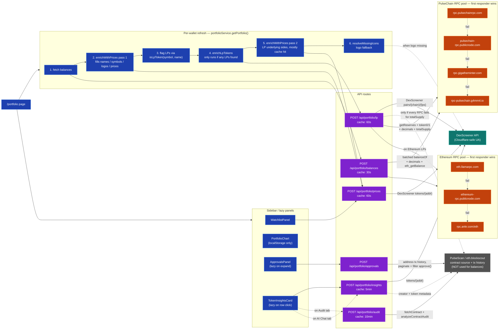
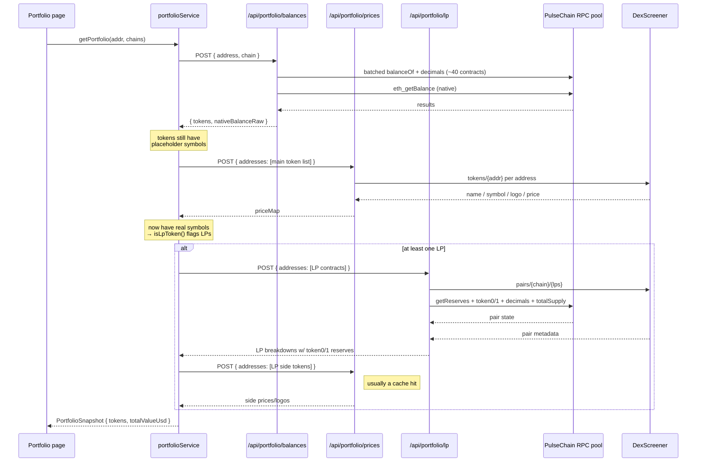
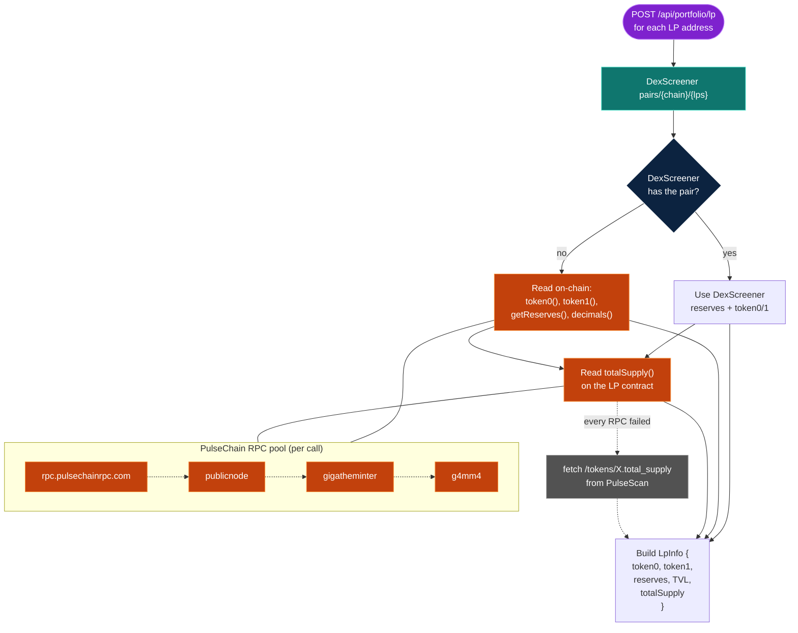
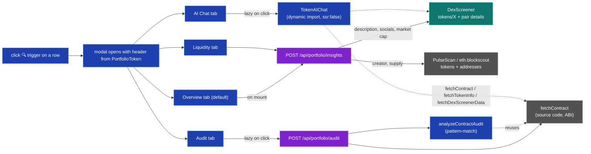

# Portfolio page — fetch graph

How every piece of data the `/portfolio` page renders gets loaded, with the
fallback chain for each external dependency.

## Legend

- 🟦 **Browser** — client-side React component or service
- 🟪 **Server** — Next.js API route running on Vercel Functions
- 🟧 **RPC** — public chain RPC endpoint (no API key)
- 🟢 **DEX** — DexScreener REST API
- ⬜ **Cache** — in-memory cache on the API route
- ➡️ solid = primary call
- ⤳ dashed = fallback on failure

## The big picture

## Detail: the wallet-refresh path

For each tracked wallet, in parallel for the chains the wallet enabled.

## Detail: LP breakdown fallback chain

The most complex piece, because it combines DexScreener pair data with
on-chain reserve reads, with two fallback paths.

## Detail: insights modal (lazy, on row click)

## Where Blockscout-shaped explorers still get used (post-Phase 11)

After dropping Blockscout for the balance path, three callers still hit
`api.scan.pulsechain.com` / `eth.blockscout.com`. None of them block the
main wallet load:

| Route | What it reads | Why explorer, not RPC |
| --- | --- | --- |
| `/api/portfolio/approvals` | Wallet's outbound tx history, filtered for `approve()` | RPC can't enumerate tx history; explorers index it |
| `/api/portfolio/audit` | Contract source code + ABI for `analyzeContractAudit` | Source code isn't on-chain; explorers verify and serve it |
| `/api/portfolio/insights` | Creator address + total supply | Convenience; we could replace `total_supply` with an RPC `totalSupply()` call |
| `/api/portfolio/lp` (totalSupply fallback only) | `tokens/<addr>.total_supply` | Last-resort if every RPC times out |

Everything else — every balance read, every price/logo/symbol, every LP
reserve — flows through DexScreener + the curated RPC pool.

## Caches at a glance

| Cache | Where | TTL | Why |
| --- | --- | --- | --- |
| portfolio history points | browser localStorage (`morbius-portfolio-v1`) | 1 year, throttled to 1 entry/hour | drives the chart |
| watchlist | browser localStorage (`morbius-watchlist-v1`) | forever | user-owned data |
| balances proxy | server in-memory | 30s | smooths double-refresh |
| prices proxy | server in-memory | 60s, positive only | failed lookups retry next time |
| lp proxy | server in-memory | 60s | reserves move slowly |
| insights proxy | server in-memory | 5min | metadata moves rarely |
| audit proxy | server in-memory | 10min | source code is immutable |
| Next.js fetch cache | server, framework-managed | per-route `revalidate` | underlying `fetch()` cache |
